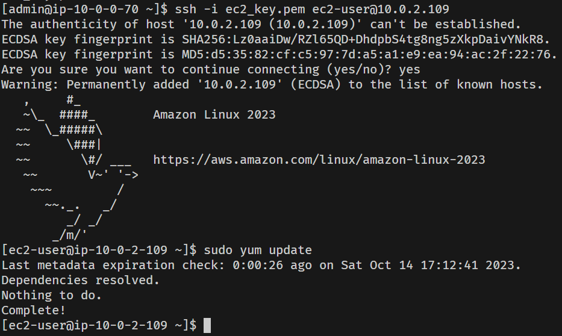
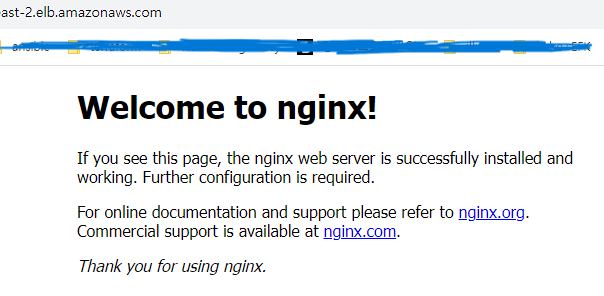
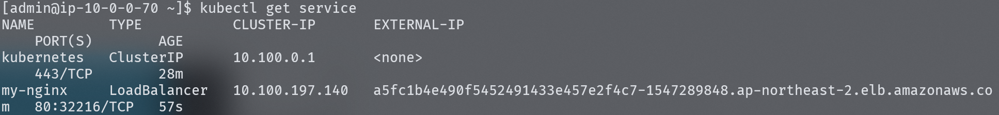
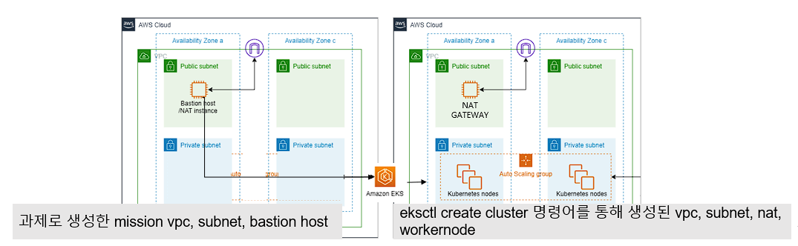
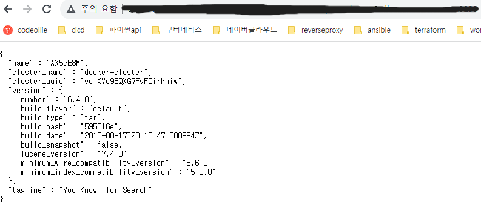
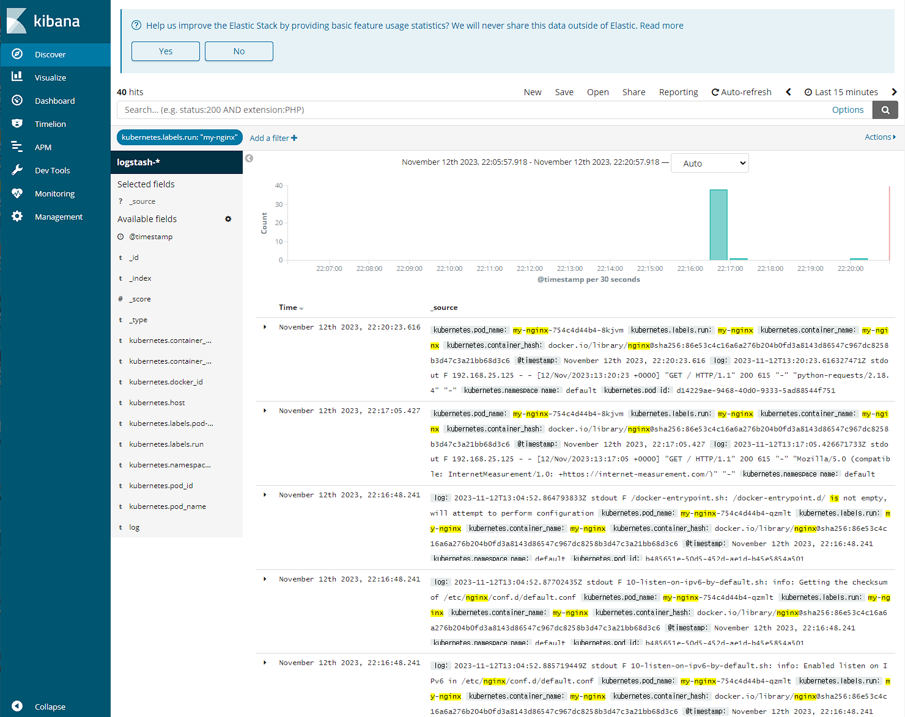
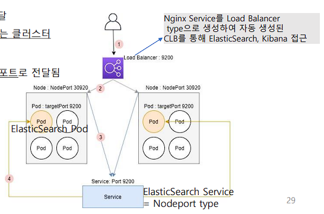
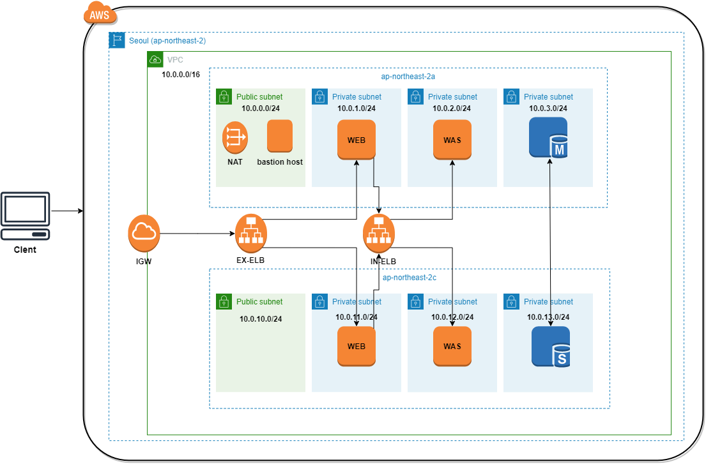
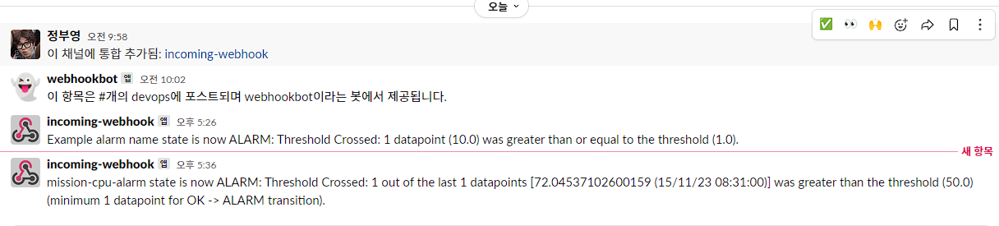

# 쿠버네티스 배포와 EFK 모니터링 구축

<details><summary>NAT 인스턴스 생성</summary>

<div markdown="1">

## 10/11~10/12

- 

- 정책 코드를 적용한 IAM 계정 Terraform을 사용해서 생성
- VPC 환경의 네트워크 인프라 구축
- 이중화된 서브넷 구성 (위 그림엔 생략)
- NAT AMI를 사용한 NAT 인스턴스 생성하여 NAT Gateway를 대체
- Public 서브넷과 Private 서브넷 간 통신 확인 위해 임시로 Private 인스턴스 생성하여 SSH
- 

### 문제점

- NAT 인스턴스에 대한 라우팅을 Private Subnet에 적용하고 보안 그룹 룰을 설정하였으나 Private 인스턴스에서 인터넷을 통한 패키지 매니저 업데이트 실패, Public은 성공

### 원인과 해결

- 원인은 NAT 인스턴스의 보안 그룹에서 NAT 인스턴스를 통해 통신하는 인스턴스의 ip 대역에 대한 ingress 룰을 허용하지 않은 것

- ingress 룰 수정으로 해결

- 

</div>

</details>

<details><summary>EKS 클러스터 구성, Nginx 배포</summary>

<div markdown="1">

## 10/29

- EKS 클러스터 구성
  - kubectl 설치
  - eksctl 설치
  - eksctl 명령어를 통해 AWS EKS 클러스터 구축
- YAML 스크립트 사용해서 Nginx 배포를 위한 Pod 생성

```yaml
apiVersion: apps/v1
kind: Deployment
metadata:
  name: my-nginx
spec:
  selector:
    matchLabels:
      run: my-nginx
  replicas: 2
  template:
    metadata:
      labels:
        run: my-nginx
    spec:
      containers:
        - name: my-nginx
          image: nginx
          ports:
            - containerPort: 80
```

- YAML 스크립트 사용해서 Nginx 서비스 실행

```yaml
apiVersion: v1
kind: Service
metadata:
  name: my-nginx
  labels:
    run: my-nginx
spec:
  ports:
    - port: 80
      protocol: TCP
  selector:
    run: my-nginx
  type: LoadBalancer
```

- 

- Nginx 배포 확인

### 의문점

- 

- 기존에 구성했던 서브넷과 다른 별도의 서브넷에 노드가 생성된 것으로 보이는데 미리 구성해둔 서브넷에 노드 생성이 가능한지

- 위와 같은 상태라면 전체 아키텍처는 어떻게 되어 있는지

- Private Subnet에 노드가 생성되었다면 어떻게 외부 접속으로 Nginx 배포를 확인할 수 있는지

- 위 궁금증의 답이 로드밸런서의 사용이라면 로드밸런서가 어떤 역할(어떤 원리로)을 해서인지

### 해결

- 우선 eksctl을 사용해서 클러스터를 생성할 경우 전혀 다른 새로운 VPC 환경에 클러스터를 생성하게 된다.

- 

- 현재 전체 아키텍처는 위와 같으며 기존에 구축한 네트워크 인프라 내에서 생성하려면 클러스터 생성시 yaml 파일을 아래와 같이 작성한 후 `eksctl create cluster -f [파일명].yaml`로 생성할 수 있다.

```yaml
apiVersion: eksctl.io/v1alpha5
kind: ClusterConfig

metadata:
  name: mission-cluster
  region: ap-northeast-2

vpc:
  subnets:
    private:
      ap-northeast-2a: { id: PrivatesubnetAid }
      ap-northeast-2c: { id: PrivatesubnetBid }

nodeGroups:
  - name: mission-wn
    labels: { role: workers }
    instanceType: t3.medium
    desiredCapacity: 1
    privateNetworking: true
    volumeSize: 4
    ssh:
      allow: true
```

- 외부에서 접속이 가능한 이유는 쿠버네티스의 Service라는 오브젝트 때문이다. 이 Service는 타입을 설정할 수 있는데 그 타입 중 로드밸런서 타입으로 생성할 경우 이 Service가 외부와 통신하며 트래픽을 private subnet에 있는 Pod로 전달해준다.

- 로드밸런서의 사용으로 이전에 생겼던 public <-> private간 네트워크 통신 문제를 해결할 수 있을 것 같고 쿠버네티스는 그동안 마주해오던 문제들의 해결법을 기능으로 갖추고 있는 느낌을 준다.

</div>

</details>

<details><summary>EFK 모니터링 구축, 로그 시각화 확인</summary>

<div markdown="1">

## 11/12

- Fluentbit가 로그를 수집하면 ElasticSearch가 로그를 저장하고 Kibana가 로그를 시각화한다.

- ElasticSearch와 Kibana의 Pod를 각각 생성한 후 NodePort 타입으로 서비스를 생성한다.

- Fluentbit의 Pod를 생성해서 로그를 수집하도록 한다.

- 

- 

### 로드밸런서의 역할

- 로드밸런서를 단순히 부하분산의 용도로 생각했다. 물론 이것도 부하분산이 목적이긴 하지만 이전에 Nginx를 사용해서 배포된 WS에서 리버스 프록시를 하려고 했던 것을 쿠버네티스 서비스로 배포된 Nginx 서비스를 로드밸런서 타입으로 배포해서 가능하게 할 수 있다.

- 그리고 다른 쿠버네티스 서비스를 NodePort 타입으로 배포할 경우 위에서 배포된 Nginx 서비스의 로드밸런서를 통해 특정 포트로 들어오는 트래픽을 받을 수 있다.

- 

- 위 그림처럼 Nginx 로드밸런서의 External-IP의 9200번 포트로 들어오는 트래픽을 ElasticSearch의 Pod로 전달하도록 할 수 있다.

- 

- 위와 같은 3-티어 아키텍처를 설계할 때 로드밸런서를 활용할 수 있다.

</div>

</details>

<details><summary>Lambda, CloudWatch, SNS를 사용해서 Slack에 경보 알람 보내기</summary>

<div markdown="1">

## 11/15

- SNS 주제를 생성한다. 여기서 SNS 주제는 특별한 설정을 하지 않고 우선 생성한다.

- KMS 키를 바스티온 호스트에서 aws-cli를 사용해서 생성한다.

- `aws kms encrypt` 명령어를 사용해서 Slack에 전달할 알림을 암호화 할 수 있도록 한다. (명령어를 사용해서 나온 출력 중 CiphertextBlob 항목을 복사하여 Lambda에서 사용할 변수로 등록한다.)

- KMS 키를 사용할 수 있도록 Lambda의 Role에 정책을 추가한다.

```json
{
  "Version": "2012-10-17",
  "Statement": [
    {
      "Sid": "Stmt1443036478000",
      "Effect": "Allow",
      "Action": ["kms:Decrypt"],
      "Resource": ["<your KMS key ARN>"]
    }
  ]
}
```

- Lambda를 생성할 때 Slack에 알림을 보낼 때 사용하는 블루프린트를 사용하고 생성해둔 SNS와 연결한다.

- Lambda에서 사용할 변수로 Slack 채널명과 위에서 출력된 값을 넣는다.

- CloudWatch에 임계값을 설정하고 미리 생성해서 Lambda와 연결해놓은 SNS와 연결한다.

- 임계값이 넘어가면 Slack 채널에 알람이 온다.

- 

</div>

</details>

# 되돌아보며

- 10월부터 한달동안 비는 시간이 생겨서 그 시간동안 무엇을 할 지 고민하다가 쿠버네티스를 다뤄보고 모니터링과 시스템 장애 대응 또한 DevOps에 포함되기 때문에 좋은 기회라고 생각했고 또 이런 내용은 배우려고 해도 배울 곳이 없기 때문에 염두에 두고 있던 이 과정을 참여했다.

- 핵심을 요약하면 다른 사람이 DevOps를 하는 방식에 대해 말로만 듣는 설명이 아니라 실제 실습을 통해 접하는 좋은 경험이었다.

- 이것이 핵심인 이유는 내가 하던 방식과 다른 사람이 하는 방식은 서로 다르고 앞으로 내가 일을 할 회사도 내가 하던 방식과 다를 것인데 기존 팀의 방식에 맞춰서 해야 하기 때문이다.

- 다르다고 느꼈던 점 그리고 다르기 때문에 들었던 의문과 그에 대한 생각 전체 과정을 진행하면서 스스로 아쉬웠던 점은 다음과 같다.

- 첫번째는 IaC 툴이 사용되지 않는 것이었다.

- 이 과정에서 모든 리소스는 콘솔에서 생성되고 별도의 엑셀 파일에 자산 관리 현황을 작성한다. 이것에 대해 의문이 있었다. IaC 툴을 사용한다면 리소스의 생성과 관리, 현황 파악까지 동시에 할 수 있기 때문이다.

- 콘솔로 리소스를 생성해본 적이 없는 것은 아니지만 특정 기술이 현업에서 만연히 사용될 것이라고 착각해서 생긴 의문이다. (이렇게 생각한 이유는 Java-Spring 때문이다.)

- 이전에 면접을 진행하면서도 JD에서 대부분 Terraform과 같은 IaC 툴을 사용해본 경험을 요구했기에 널리 사용되는 툴이라고 생각했지만 그렇지 않았다. 사용하지 않는 회사도 있었고 사용하더라도 기술에 치중되는 접근을 지양하는 분위기였다.

- IaC 툴을 잘 다룰 수 있다면 당연히 좋은 것이지만 코드로 인프라를 다룬다는 게 DevOps를 잘한다는 의미도 아니고 스타트업이던 대기업이던 어떤 기술을 얼만큼 잘 사용하는 지는 그렇게 크게 중요한 점은 아니었고 사용할 수도 아닐 수도 있는 것이었다.

- 그리고 그동안 앱이 동작하기 위한 인프라를 구축하는 데에만 Terraform을 주로 사용하고 여타 다른 리소스들의 생성과 관리는 많이 접해보지 못했는데 계정, 역할, 정책 등의 리소스도 존재하고(심지어 계정은 콘솔에서 추가적인 설정이 반드시 필요하다.) 마지막 알람 설정에서 필요한 SNS, Lambda와 같이 처음 접하는 리소스도 존재했기 때문에 IaC 툴로 100% 모든 리소스를 관리하는 것은 절대로 쉬운 일이 아니구나라는 생각을 했다.

- 두번째는 아쉬운 점으로 쿠버네티스를 정말 다뤄보기만 했고 모니터링 툴을 정말 구축만 해본 것이다.

- 쿠버네티스의 AtoZ를 공부한 것은 아니였고 이전에 공부하려고 시작할 때에도 다른 내용과 같이 공부하기에는 양이 많고 이해가 쉽게 되지 않아서 나중으로 미뤘었다.

- 그래도 당장 클러스터를 생성하고 Node, Pod, Service를 생성하는 데에 필요한 만큼은 빠르게 공부해서 사용했고 기본적인 틀과 쿠버네티스라는 기술의 의의를 이해하는 데에는 성공했다.

- 모니터링 툴은 EFK 스택 중 각 툴이 정확히 어떻게 동작하고 서로 어떻게 연동되는 지를 아직 이해하지 못해서 내가 모니터링 구축을 어느정도 알고 있는 지를 파악하기가 어렵다.

- 그래도 처음 접한 내용이기 때문에 쿠버네티스는 사용할 자신감을 얻었고 모니터링은 구축을 해본 것 만으로도 충분히 많은 것을 얻었다고 생각한다.

- 그동안을 돌아보니 참 열심히도 살아온 것 같다. 여기서는 개발에 대한 부분만 쓰지만 그것만 하더라도 아무것도 모르는 채로 무작정 캡스톤에 리액트로 맨땅에 헤딩하듯이 부딪치고 JS를 접하면서 JS로 할 수 있는 다양한 것들을 시도하고 학교 다니면서 운영체제 책들 복습, 정리도 하고 18학점 들으면서 프론트엔드 부트캠프 병행하다가 나와서 우테코 프리코스랑 병행하고 끝나자마자 도커, 데이터베이스, 리눅스, 네트워크 공부하면서 사이드 프로젝트 챌린지로 DevOps/SRE 접하고 바로 면접 한번 봐보고 뭐 필요한지 파악해서 백엔드 온라인 부트캠프에서 스프링 배우고 앱 구현 + 인프라 구축 + CI/CD 구축 포트폴리오 준비해서 DevOps 면접들 보고 지금 여기까지 상세하게 적으면 훨씬 더 많은 내용이 있지만 그건 여기에 쓰기보다 블로그에 쓰는 것이 맞는 것 같고 아무튼 지금까지 2년동안 참 열심히도 살았으며 그 과정에서 많은 것들을 느끼면서 알차게 잘 산 것 같다.

- 지난 날들을 그렇게 하나하나 되돌아본 적은 없었는데 최근에 가장 친한 친구가 그동안 봐온 내 20대의 삶이 어떻게 보였는지를 말해준 것이 계기가 되어서 자세히 돌아보게 되었고 참 가슴 깊이 뿌듯함을 느꼈다.

- 누구나 자신이 노력해온 시간에 뿌듯함을 느낄 수 있다. 그런데 몇몇 사람들이 자부심을 넘어 심각한 자만심을 가지고 오만하게 행동하는 것을 많이 봐왔다. 자신이 한 노력을 객관화 해볼 생각을 가지지 않고 세상에서 가장 큰 것이라고 착각하는 것 같다.

- 하던 대로 처음 마음 먹었던 대로 어차피 그 사람들이 일반적인 것은 아니기 때문에 내가 어떤 것을 느끼고 어떤 점을 깨달았는 지에 대해 집중하고 앞으로 할 것에 대해 생각하자.

- 이렇게 새로운 것을 접하고 배우며 내 자신이 점점 풍요로워 지는 것을 만끽할 수 있는 시간도 4개월 밖에 남지 않았다. 아쉽거나 그렇지는 않다. 후회없이 열심히 해왔고 옳다고 생각하는 방향으로 주저없이 나아가던 시간이었다.

- 글을 마무리하자면 비는 시간 없이 빽빽하게 채워진 지난 시간동안 내가 잘하는 것, 좋아하는 것, 잘 맞는 것을 찾았고 그것을 더 잘할 수 있게 되기 위해 필요한 것을 찾아서 이제 한 챕터의 마무리를 앞두고 있다. 다음 챕터로 넘어가기 전 이 시간을 잘 활용해서 나중에 또 되돌아 봤을 때 뿌듯함을 느끼고 싶다.

## 출처 : 코멘토 대기업 IT현직자와 함께 클라우드 AWS 구축부터 운영까지 실무 AtoZ
