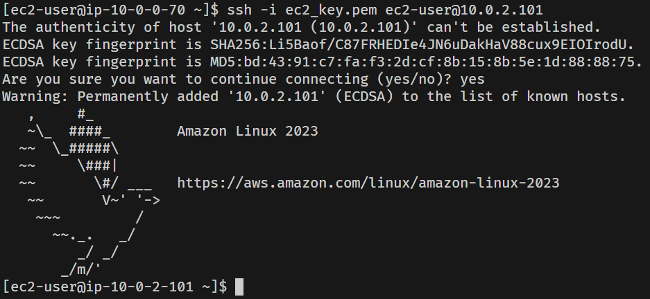

# 쿠버네티스 배포와 EFK 모니터링 구축

## 10/11~10/12

- 

- 정책 코드를 적용한 IAM 계정 Terraform을 사용해서 생성
- VPC 환경의 네트워크 인프라 구축
- 이중화된 서브넷 구성 (위 그림엔 생략)
- NAT AMI를 사용한 NAT 인스턴스 생성하여 NAT Gateway를 대체
- Public 서브넷과 Private 서브넷 간 통신 확인 위해 임시로 Private 인스턴스 생성하여 SSH
- 

### 문제점

- NAT 인스턴스에 대한 라우팅을 Private Subnet에 적용하고 보안 그룹 룰을 설정하였으나 Private 인스턴스에서 인터넷을 통한 패키지 매니저 업데이트 실패, Public은 성공

### 원인과 해결

- 원인은 NAT 인스턴스의 보안 그룹에서 NAT 인스턴스를 통해 통신하는 인스턴스의 ip 대역에 대한 ingress 룰을 허용하지 않은 것

- ingress 룰 수정으로 해결

- 

## 10/29

- EKS 클러스터 구성
  - kubectl 설치
  - eksctl 설치
  - eksctl 명령어를 통해 AWS EKS 클러스터 구축
- YAML 스크립트 사용해서 Nginx 배포를 위한 Pod 생성

```yaml
apiVersion: apps/v1
kind: Deployment
metadata:
  name: my-nginx
spec:
  selector:
    matchLabels:
      run: my-nginx
  replicas: 2
  template:
    metadata:
      labels:
        run: my-nginx
    spec:
      containers:
        - name: my-nginx
          image: nginx
          ports:
            - containerPort: 80
```

- YAML 스크립트 사용해서 Nginx 서비스 실행

```yaml
apiVersion: v1
kind: Service
metadata:
  name: my-nginx
  labels:
    run: my-nginx
spec:
  ports:
    - port: 80
      protocol: TCP
  selector:
    run: my-nginx
  type: LoadBalancer
```

- 

- Nginx 배포 확인

### 의문점

- 

- 기존에 구성했던 서브넷과 다른 별도의 서브넷에 노드가 생성된 것으로 보이는데 미리 구성해둔 서브넷에 노드 생성이 가능한지

- 위와 같은 상태라면 전체 아키텍처는 어떻게 되어 있는지

- Private Subnet에 노드가 생성되었다면 어떻게 외부 접속으로 Nginx 배포를 확인할 수 있는지

- 위 궁금증의 답이 로드밸런서의 사용이라면 로드밸런서가 어떤 역할(어떤 원리로)을 해서인지
